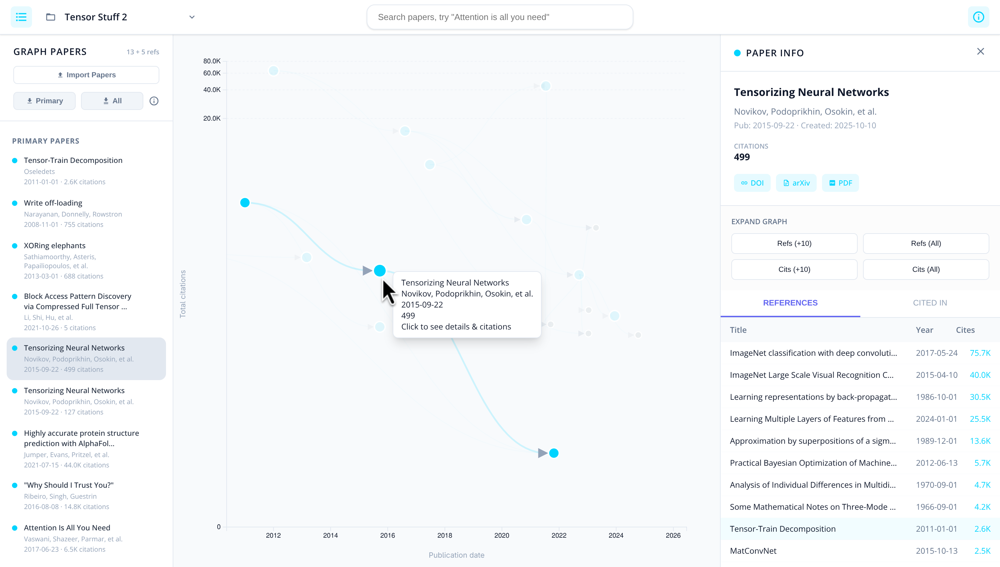

# Paper Explorer


A minimal, high-performance research paper exploration tool. Visualize citation graphs, discover references, and navigate the academic landscape with ease.

<br>



## Features

- **Interactive Citation Graph**: Visualize research relationships across a timeline with citation counts mapped to a responsive vertical scale.
- **Real-time Discovery**: Instant search and expansion of references or citations via the OpenAlex API.
- **Flexible Import**: Scrape DOIs from `.bib` files or raw text lists using a robust, regex-based extraction engine.
- **Professional Export**: Generate clean, standardized BibTeX files compatible with Zotero, Mendeley, and LaTeX.
- **Smart Hierarchy**: Manage your workspace by promoting secondary discoveries to primary nodes or demoting papers to reduce noise.
- **Direct Access**: Quick links to ArXiv PDFs and OpenAlex landing pages integrated directly into the sidebar.
- **Modern Performance**: A lightweight, neo-brutalist UI built for speed and clarity.

## Getting Started

This project is built with **Vite**, **TypeScript**, and **D3.js**.

### Prerequisites

- [Bun](https://bun.sh/) (recommended) or [Node.js](https://nodejs.org/)

### Installation

```bash
# Clone the repository
git clone https://github.com/aziis98/paper-explorer.git
cd paper-explorer

# Install dependencies
bun install
```

### Development

```bash
bun dev
```

### Build

```bash
bun run build
```

## Built With

- **[D3.js](https://d3js.org/)** - For the interactive graph visualization.
- **[OpenAlex API](https://openalex.org/)** - For comprehensive academic metadata.
- **[TypeScript](https://www.typescriptlang.org/)** - For type-safe development.
- **[Vite](https://vitejs.dev/)** - For a lightning-fast build pipeline.
